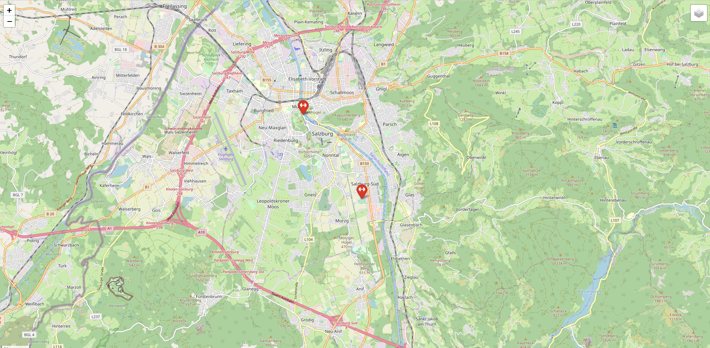

# Objectives
In this small notebook the focus is to check out basic functions and visualization options of the package <b>folium</b>. 
Steps that were done:
1. Creating a base map with a certain zoom level and location
2. adding some accustomed markers
3. adding another basemap layer

Referencess used:
https://www.python-graph-gallery.com/312-add-markers-on-folium-map
https://python-visualization.github.io/folium/modules.html
